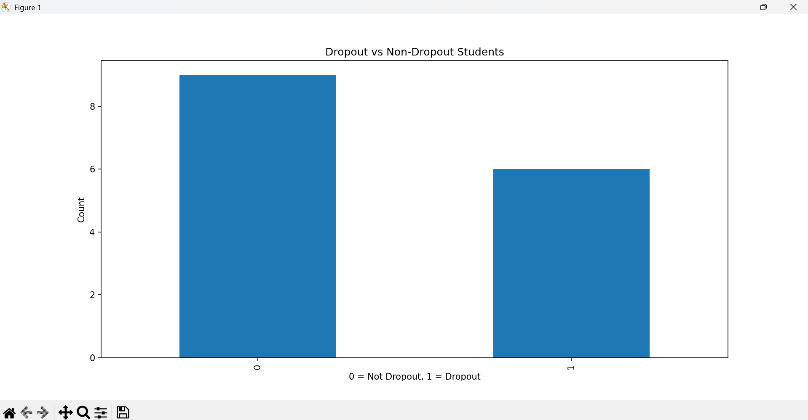

# Student Dropout Risk Prediction
A regression model predicting student final scores
from attendance, study hours, and prior academic
performance — built to identify at-risk students early.

## The Problem
Students who are falling behind don't always show
obvious signs early. Predicting performance from
early indicators gives educators time to intervene.

## What I Built
A Linear Regression model trained on student data
using 3 key predictors:
- Attendance percentage
- Weekly study hours
- Previous academic performance

Evaluated using Mean Squared Error (MSE).

## Key Finding
Attendance was the strongest single predictor —
stronger than study hours alone.

## Tech Stack
Python · Scikit-learn · Pandas · Matplotlib · Numpy

## How to Run
pip install -r requirements.txt
python student_dropout_prediction.py

## Honest Limitation
This predicts scores, not actual dropout —
the title is aspirational for now.
True dropout prediction needs longitudinal data
across multiple semesters, not a single dataset.
Next version: classify actual dropout risk using
a real multi-semester dataset.
